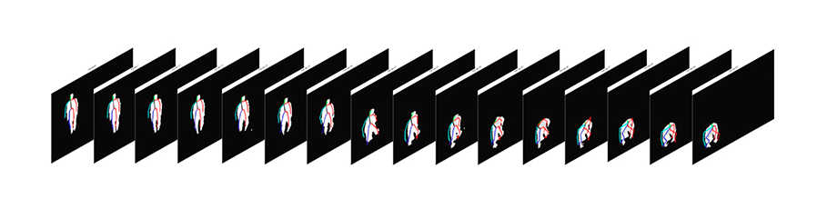
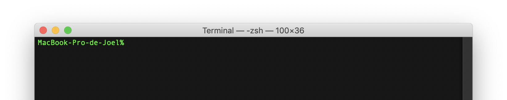
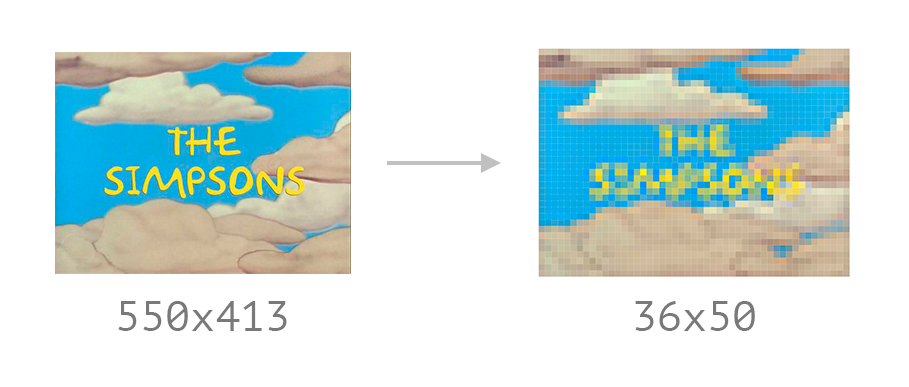
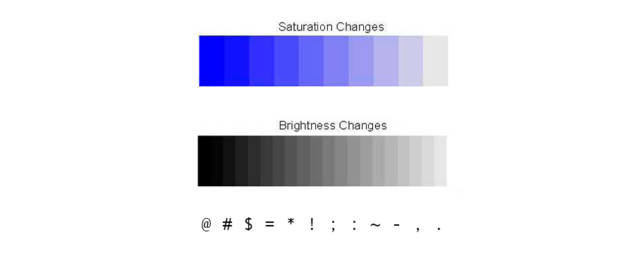
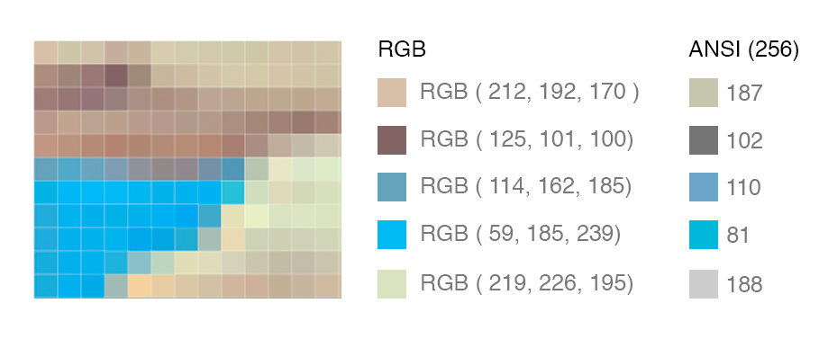
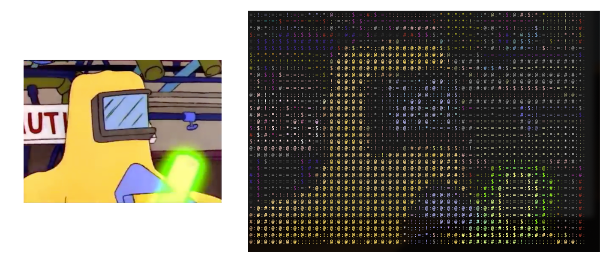

<br/><br/>
It's a simple python package to play videos in a terminal using [ASCII](https://en.wikipedia.org/wiki/ASCII) characters.

[](https://badge.fury.io/py/video-to-ascii)
[](https://codeclimate.com/github/joelibaceta/video-to-terminal/maintainability)
[](https://github.com/joelibaceta/video-to-ascii)
[](http://hits.dwyl.io/joelibaceta/https://github.com/joelibaceta/video-to-ascii)


## Installation
```bash
pip install video-to-ascii
```

> The installation should copy the main script to your PATH and making it available for general use.

## How to use

In your terminal just run `video-to-ascii` + your video path.

```bash
$ video-to-ascii myvideo.mp4
```

## How it works

Every video is composed by a set of frames that are played at a certain frame rate.



Since a terminal has a specific number of rows and columns, we have to resize our video to adjust to the terminal size limitations.



To reach a correct visualization of an entire frame we need to adjust the _frame height_ to match the _terminal rows_, avoiding using more _characters_ than the number of _terminal columns_.



When picking a character to represent a pixel we need to measure the relevance of that pixel's color in the frame, based on that we can then select the most appropriate character based on the intensity they represent.



The reduced range of colors supported by the terminal is a problem we need to account for. Modern terminals support up to 256 colors, so we need to find the closest 8 bit color that matches the original pixel color, we call this set of 256 colors [ANSI colors](https://stackoverflow.com/questions/4842424/list-of-ansi-color-escape-sequences).



Finally, when putting it all together, we will have an appropriate character for each pixel and a new color.



