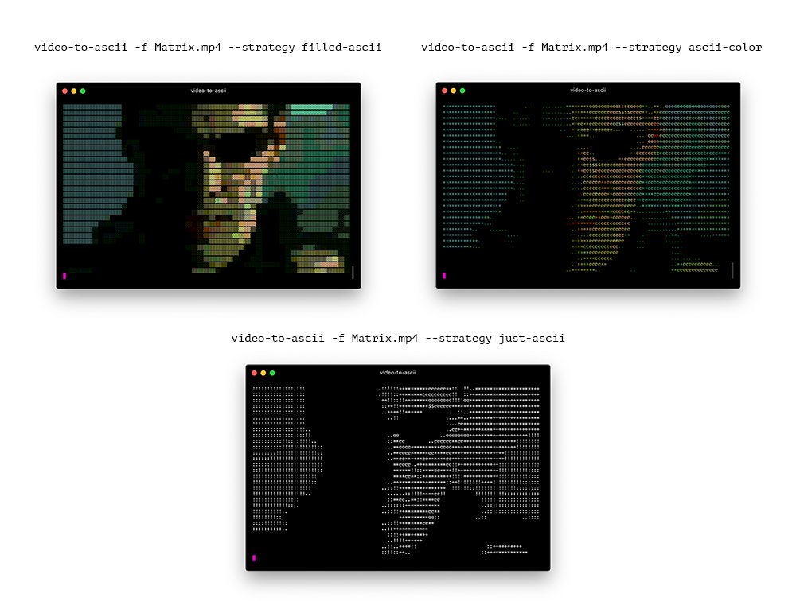
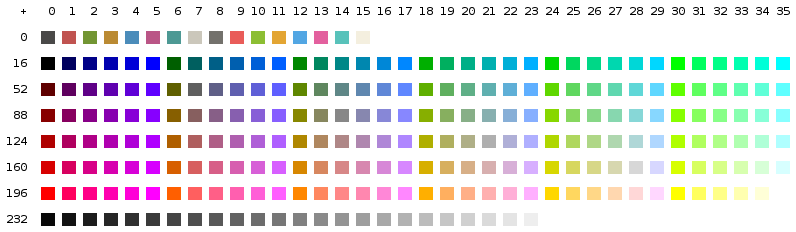

<center>
  
   
  
</center>

<p align="center">
  
  It's a simple python package to play videos in a terminal using [ASCII](https://en.wikipedia.org/wiki/ASCII) characters.
  
  [](https://opencollective.com/video-to-ascii) [](https://badge.fury.io/py/video-to-ascii)
  [](https://codeclimate.com/github/joelibaceta/video-to-terminal/maintainability)
  [](https://github.com/joelibaceta/video-to-ascii)
  [](http://hits.dwyl.io/joelibaceta/https://github.com/joelibaceta/video-to-ascii)

</p>


## Requirements
- Python3
- PortAudio (_Only required for installation with audio support_)
- FFmpeg (_Only required for installation with audio support_)

## Installation
Standard installation
```bash
pip3 install video-to-ascii
```
With audio support installtion
```bash
pip3 install video-to-ascii --install-option="--with-audio"
```

## How to use

Just run `video-to-ascii` in your terminal

```bash
$ video-to-ascii -f myvideo.mp4
```

### Options

**--strategy**
Allow to choose an strategy to render the output



**-o --output**
Export the rendering output to a bash file to share with someone


**-a --with-audio**
If an installation with audio support was made, you can use this option to play the audio track while rendering the video ascii characters.
<br/>

## How it works

Every video is composed by a set of frames that are played at a certain frame rate.


Since a terminal has a specific number of rows and columns, we have to resize our video to adjust to the terminal size limitations.


To reach a correct visualization of an entire frame we need to adjust the _frame height_ to match the _terminal rows_, avoiding using more _characters_ than the number of _terminal columns_.


When picking a character to represent a pixel we need to measure the relevance of that pixel's color in the frame, based on that we can then select the most appropriate character based on the [relative luminance](https://en.wikipedia.org/wiki/Relative_luminance) in colorimetric spaces, using a simplify version of the luminosity function.


> Green light contributes the most to the intensity perceived by humans, and blue light the least.


This function returns an integer in the range from 0 to 255, we assign a character according to density to show more colored surface for areas with more intense color (highest values).

```python
CHARS_LIGHT 	= [' ', ' ', '.', ':', '!', '+', '*', 'e', '$', '@', '8']
CHARS_COLOR 	= ['.', '*', 'e', 's', '@']
CHARS_FILLED    = ['░', '▒', '▓', '█']
```

<br/>

The reduced range of colors supported by the terminal is a problem we need to account for. Modern terminals support up to 256 colors, so we need to find the closest 8 bit color that matches the original pixel in 16 or 24 bit color, we call this set of 256 colors [ANSI colors](https://stackoverflow.com/questions/4842424/list-of-ansi-color-escape-sequences).




Finally, when putting it all together, we will have an appropriate character for each pixel and a new color.


## Contributors

### Code Contributors

This project exists thanks to all the people who contribute. [[Contribute](CONTRIBUTING.md)].
<a href="https://github.com/joelibaceta/video-to-ascii/graphs/contributors"></a>

### Financial Contributors

Become a financial contributor and help us sustain our community. [[Contribute](https://opencollective.com/funny-opensource-projects/contribute)]

Or maybe just [buy me a coffee](ko-fi.com/joelibaceta)

#### Individuals

<a href="https://opencollective.com/funny-opensource-projects"></a>

#### Organizations

Support this project with your organization. Your logo will show up here with a link to your website. [[Contribute](https://opencollective.com/video-to-ascii/contribute)]

<a href="https://opencollective.com/funny-opensource-projects/organization/0/website"></a>
<a href="https://opencollective.com/funny-opensource-projects/organization/1/website"></a>
<a href="https://opencollective.com/funny-opensource-projects/organization/2/website"></a>
<a href="https://opencollective.com/funny-opensource-projects/organization/3/website"></a>
<a href="https://opencollective.com/funny-opensource-projects/organization/4/website"></a>
<a href="https://opencollective.com/funny-opensource-projects/organization/5/website"></a>
<a href="https://opencollective.com/funny-opensource-projects/organization/6/website"></a>
<a href="https://opencollective.com/funny-opensource-projects/organization/7/website"></a>
<a href="https://opencollective.com/funny-opensource-projects/organization/8/website"></a>
<a href="https://opencollective.com/funny-opensource-projects/organization/9/website"></a>
